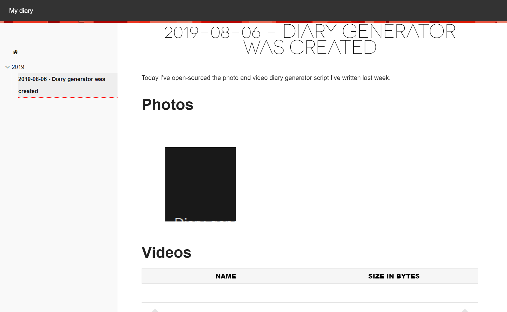

# My Diary generator

A photo and video diary generator that keeps stuff organized in a directory and file structure. 

The need for this project was born because I wanted to create a diary of my children with great moments from the birth until they are old enough to take care of themselves. At first I used OneDrive, but it didn't support large(r) movies and does not allow lots of pages and sections to be full of photos. Then I started looking for software that would still be around in about 20 years and would not hijack / create a vendor lock-in for the content. I also didn't want SaaS (Software as a Service) because I didn't feel like paying for something for 20 years and not knowing whether it will still be around in 20 years.

This generator makes it very easy to create a diary of any photos / videos that you want to keep in an organized manner. It will generate a static website using [Hugo][1] with all the content.



## Features

### Included

#### Organize everything in folders and files

The organization is super simple. Just create folders for special moments (e.g. a specific date) and copy the photos / videos in there. Then you create the `_index.md` in the folder and the generator will take care of the rest.

#### Support for local file systems

It is recommended to keep the image files on a synced drive (e.g. OneDrive, Dropbox, whatever you prefer). I don't like to publish personal content to the web, so I keep the websites on disk so only my family can view them. The websites generated should be fully usable on a local file system.

#### Automatically convert iOS (HEIC) image files to jpg

Browsers cannot display HEIC photos by default. Therefore this script converts them to jpg on the fly (of course without modifying the original files). Support for other RAW image formats will be considered on request. 

#### Replace special values in the description pages

Since the organization structure should be very similar to the titles, the generator allows for specific special values in the `_index.md` pages.

| Value   | Description          |
|---------|----------------------|
| [TITLE] | Title of the folder. |

#### Create image galleries with (auto-generated) thumbnails

Under the hood, this generator uses a customized version of the [easy gallery shortcode for Hugo][2]. It automatically creates a thumbnail for each image so the gallery itself will be fast, even though the actual images can still be very large (original size).

#### Create video tables

The generated leverages Hugo to automatically generate a "video gallery", which is simply a table that lists all the videos.

### Not included

#### Mobile device support

This tool does not do anything specific for mobile devices. It generates a static website (that is obviously viewable with a mobile device), but you cannot manage the content easily via a mobile device.

## To be considered

Obviously this script was written for myself (but in a generic way). There is (obviously) room for improvement, which you might want to help out with:

* Support custom website `content.toml` files (override themes, etc)
* Support more RAW image formats (to jpg conversion)
* Automatically create `_index.md` if not found to make it even easier to create diaries

## File system layout

```
.\Diary 1\      | Actual content of diary 1 
.\Diary 2\      | Actual content of diary 2
.\Generator\    | The generator code, will generate the static sites for the diaries
.\output\       | The generated output
```

The reason the diaries are 1 level up of the generator is to prevent accidental check-ins of (sensitive / personal) photos / videos into source control.

## Getting started

### Installing prerequisites

The generator uses some external tools for functionality.

* [Hugo][1] \* (install via [Chocolatey](https://chocolatey.org/packages/hugo))
* [ImageMagick][4] \* (install via [Chocolatey](https://chocolatey.org/packages/imagemagick))
* [CopyTrans HEIC for Windows][5]

\* *Make sure that this tool is available via the `%PATH%` environment variable*

### Cloning the generator

Choose a directory to store your diaries. For example, `C:\users\[your name]\OneDrive\Diaries` is a good choice. Then clone this repository into `Generator` so you will have this folder:

`C:\users\[your name]\OneDrive\Diaries\Generator`

Then all diaries can be added to `C:\users\[your name]\OneDrive\Diaries` and will all be synced / backed up via OneDrive.

### Creating a diary

To start a new diary, create a directory on your file system. Make sure to place the generator inside the same directory, so your directory structure will look like this in case the diary is called `My life`:

```
.\My life\
.\Generator\
```

### Adding content

I like to structure my content in years, then dates. To add new content, make sure there is a year folder, then add the date content. It will result in the following folder structure:

```
.\My life\
.\My life\2019\
.\My life\2019\2019-08-06 - Diary generator was created\
.\Generator\
```

Copy all your photos and videos that you want inside the diary to the `2019-08-06 - Diary generator was created` folder. Finally, create the file `_index.md` in that same folder with the following content:

```
+++
title = "[TITLE]"
description = ""
+++

Today I've open-sourced the photo and video diary generator script I've written last week.





```

*Note 1: only update the description part, the rest is a template (that we can hopefully simplify in the future)*

*Note 2: that once you have 1 `_index.md`, it's easiest to copy the file from another folder and just update the description.*

### Generate the static site

Create 1 or more diaries and run the generator in `.\Generator\Scripts - generate site.ps1`.

Enjoy the output in `.\output\My life\` by opening `index.html` in the root.


  [1]: https://gohugo.io/
  [2]: https://github.com/liwenyip/hugo-easy-gallery/
  [3]: https://gohugo.io/
  [4]: https://imagemagick.org/index.php
  [5]: https://www.copytrans.net/copytransheic/
